# 마크다운 문서 사용법

## 제목
#의 개수로 제목의 크기를 표현한다. 하위 제목으로 갈수록 #의 개수가 많아진다.

## 문단
빈 줄(줄바꿈) 하나가 문단을 구분한다. 즉, 엔터키를 두 번 쳐야 줄바꿈이 된다.

## 글꼴 처리
굵게 : `**굵게**`

기울임 : `*기울임*`

강조 : `***강조***`

취소선 : `~~삭제~~`

## 인라인 코드
`pip install pandas`

`을 텍스트 양 옆에 넣어 사용한다. 명령어, 함수명, 변수명 표시에 적합하다. 위의 글꼴 처리 방법을 그대로 보여주면서 사용했다.

## 코드 블록
```python
for int in ints:
    print(int)
```

`을 3번 붙여서 코드 위 아래에 넣어 사용한다. 언어를 지정하고 코드를 사용하기 적합하다.

## 목록
- a
- b
- c
    - 1
    - 2
- d
    1. ㄱ
    2. ㄴ
    3. ㄷ

위와 같이 들여쓰기, -, 번호로 사용한다.

## 체크리스트

- [ ] 구현
- [ ] 테스트
- [x] 완료

깃허브같은 사이트에서 렌더러를 지원해준다면, 체크박스 기능을 사용할 수 있다.

## 인용문
> 중요 내용
>> 세부 내용

`>`을 사용해서 인용문을 작성한다.

## 수평선
1234567890
---
1234567890
***
1234567890
___
```
---

***
___
```
문서를 구분할 때 사용한다.

## 링크
- 일반 링크
[GitHub](https://github.com)
- 자동 링크
<https://github.com>
```
[GitHub](https://github.com)
<https://github.com>
```
링크 대신에 텍스트를 넣을 때 일반 링크를 사용한다.

## 이미지
```

```
이미지를 넣을 때 같은 폴더에 이미지가 있어야 한다. 다른 폴더에 있는 경우, 아래 상대경로 예시를 참고한다.
```
하위폴더에 있을 때


상위폴더에 있을 때
 << ../../../의 방식으로 상위 단계를 구분
```

아니면 인터넷에 올라가 있는 이미지 주소를 그대로 넣을 수 있다.
```

```

## 표
| 이름 | 역할 |
|------|------|
| 김철수 | 개발 |
| 홍길동 | 기획 |

| 왼쪽 | 가운데 | 오른쪽 |
|:-----|:------:|------:|

```
| 이름 | 역할 |
|------|------|
| 김철수 | 개발 |
| 홍길동 | 기획 |

| 왼쪽 | 가운데 | 오른쪽 |
|:-----|:------:|------:|
```

## 이스케이프 문자
```
\*
\`
\#
\[
```
위와 같이 사용하면 `를 사용하지 않고도 문자 그대로 출력한다.

## 접기
<details>
<summary>클릭해서 보기</summary>

숨겨질 내용

</details>

```
<details>
<summary>클릭해서 보기</summary>

숨겨질 내용

</details>
```
위와 같이 사용한다.

## Mermaid 다이어그램
지원 종류
- Flowchart
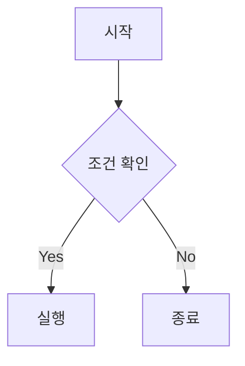
- Sequence Diagram
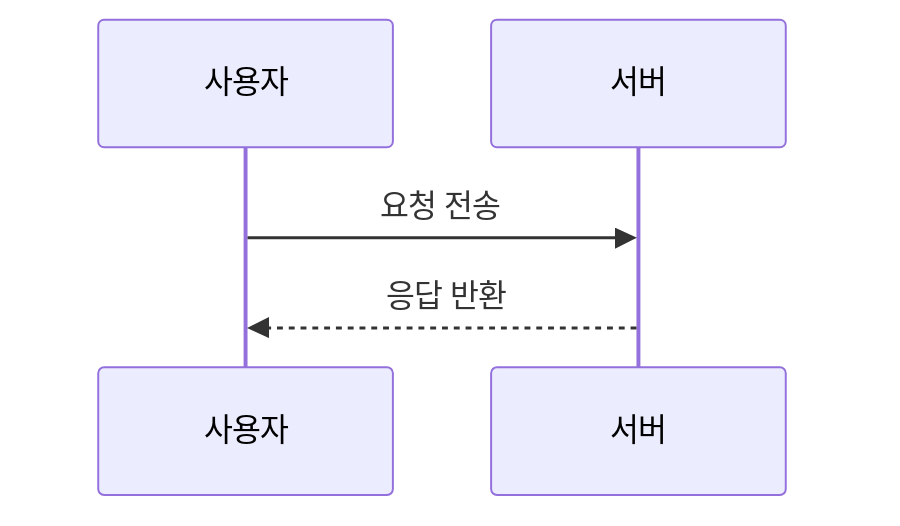
- Class Diagram
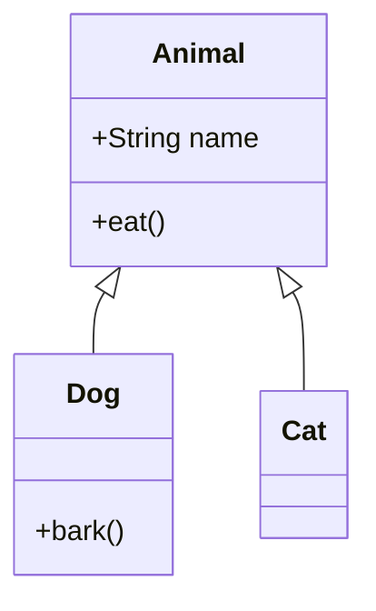
- State Diagram
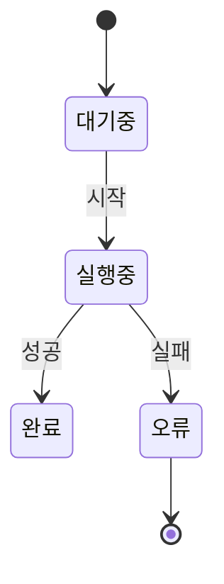
- ER Diagram
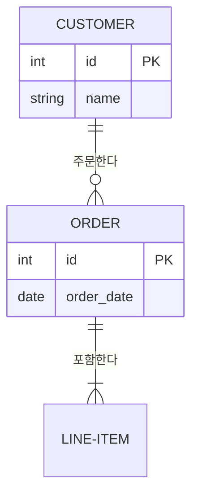
- Gantt Chart
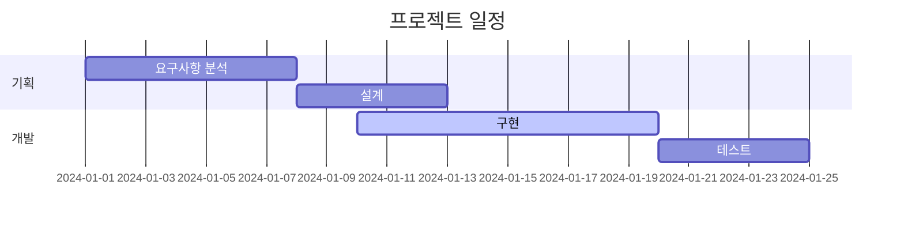
- Pie Chart
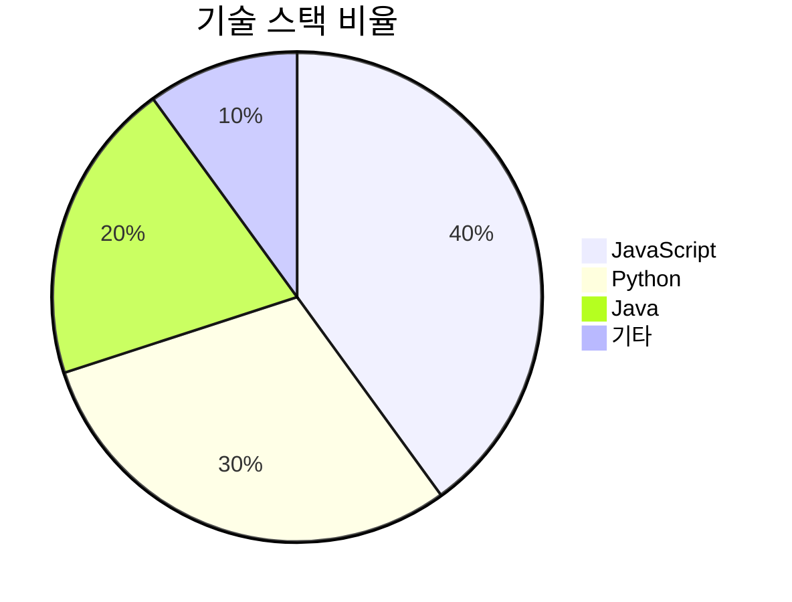
- Git Graph
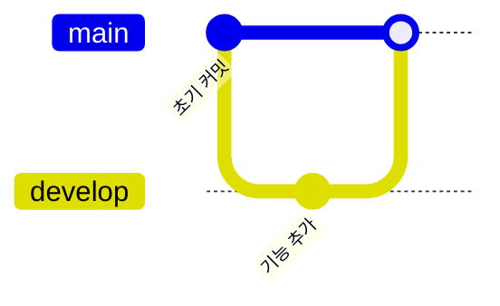
- XY Chart
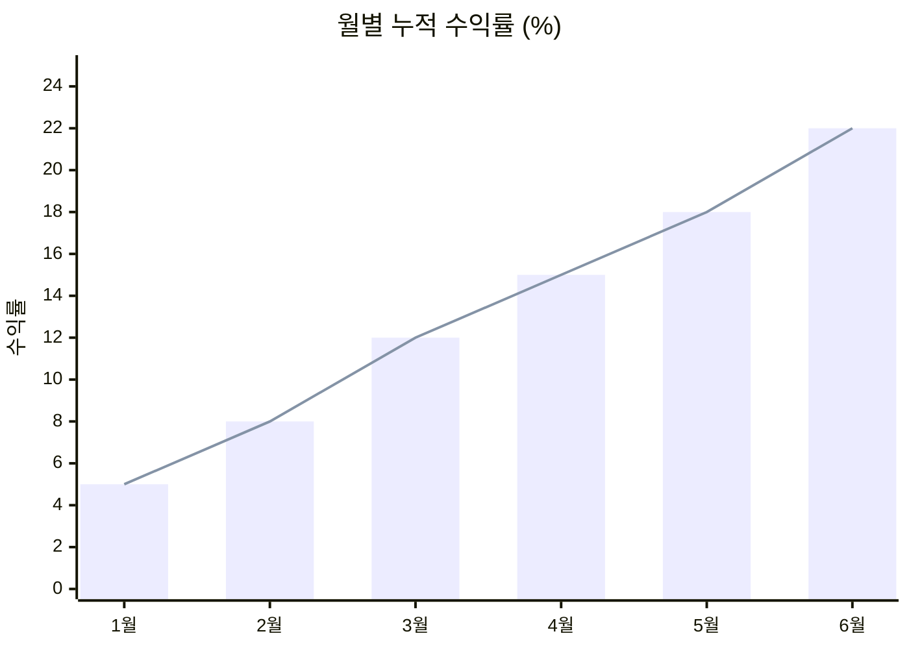
- User Journey
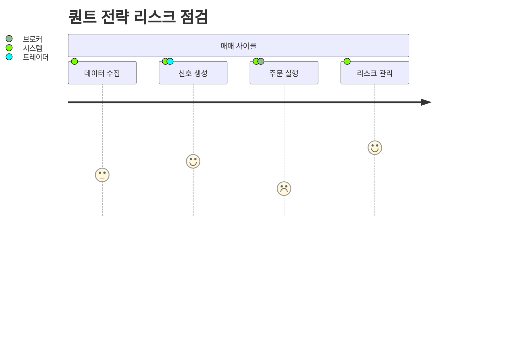
- Kanban
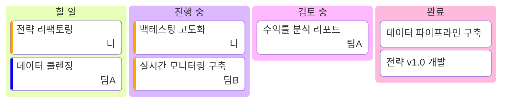
- Quadrant Chart
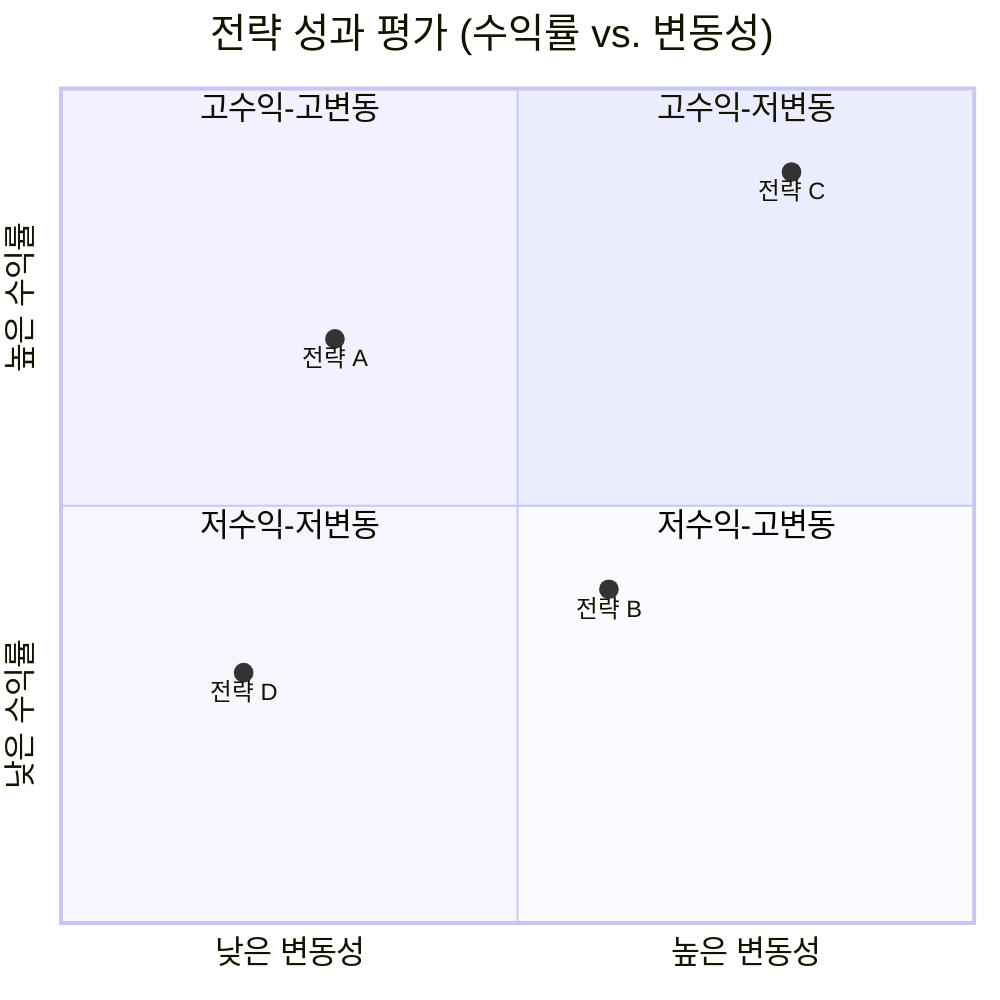
- C4 Diagram
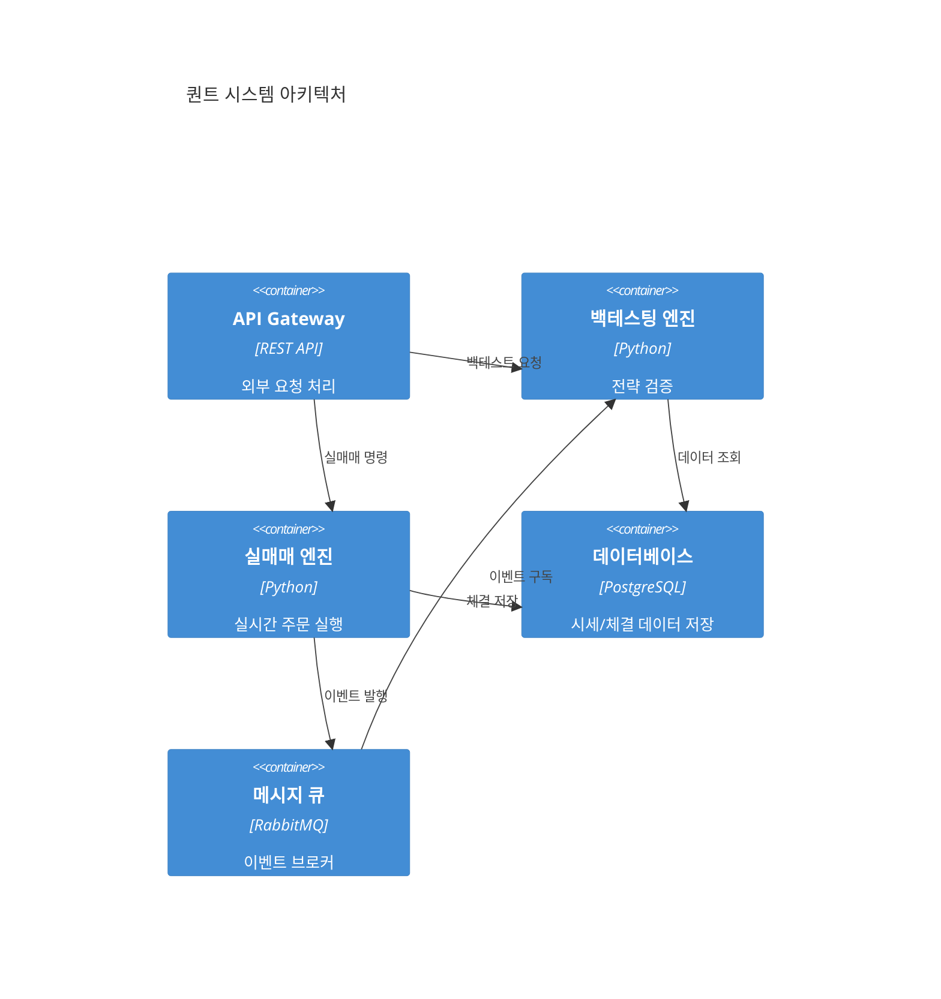

모든 다이어그램은 %%로 주석을 추가할 수 있다.

## 앵커 링크
[목록으로 이동](#목록)
```
[(챕터명)으로 이동](#챕터명)
```
위와 같이 사용하여 긴 문서에서 빠르게 챕터를 이동할 수 있다.

## VS 코드 단축키
| 단축키              | 기능     |
| ---------------- | ------ |
| Ctrl + Shift + V | 미리보기   |
| Ctrl + K → V     | 옆 미리보기 |
| Ctrl + Space     | 자동완성   |
| Alt + Shift + F  | 문서 정렬  |
| Ctrl + /         | 주석     |